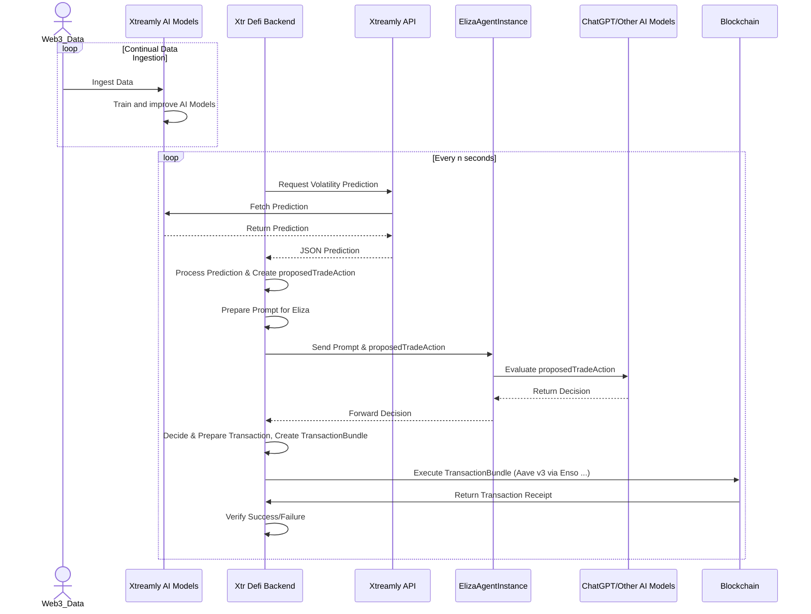
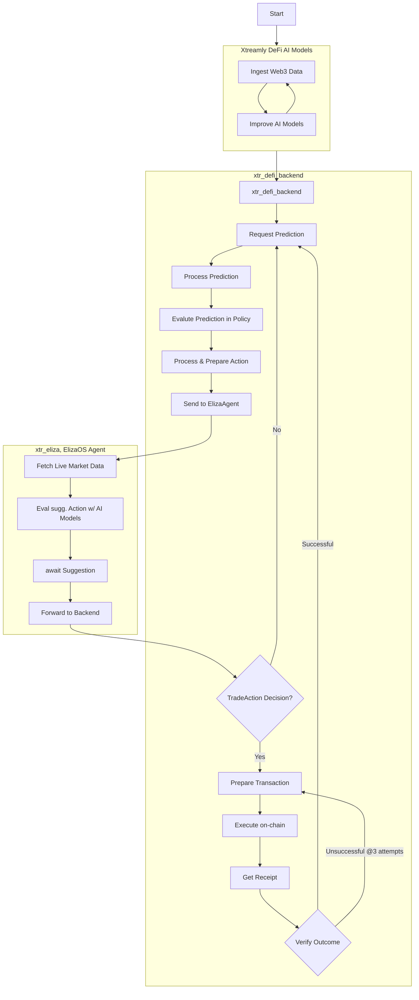

# Xtreamly Loop Leverage Trading Bot Prototype @Aave v3, Arbitrum

## Overview

This prototype is an automated trading bot that executes leveraged long/short positions on ETH using Aave V3's lending protocol on Arbitrum. It solves the problem of manual position management by:

1. Using ML-based volatility prediction provided by Xtreamly
2. Automatically executing bundles of multi-step lending/borrowing transactions via Enso API
3. Managing risk through real-time health factor monitoring and position size optimization by calling Aave V3's smart contracts.


The bot is built with TypeScript, express.js, viem, integrating several key technologies:

- ElizaOS: For Agentic decision making
- Aave V3 Protocol: For lending USDC as collateral and borrowing ETH
- Enso Finance API: For gas-optimized transaction bundling and execution
- Custom ML APIs: For ETH volatility predictions and market state recognition
- Arbitrum L2: For fast, low-cost transactions on Ethereum

## Features

- **Leverage Trading**: Users can deposit USDC and borrow ETH, allowing for leveraged trading strategies.
- **Real-time Data Fetching**: The application fetches volatility predictions and state data from Xtreamly API.
- **AI Integration**: The Eliza agent provides user interaction and insights based on the fetched data.

## Setup Instructions

### Prerequisites

- Ensure you have [Node.js](https://nodejs.org/) installed.
- Install [pnpm](https://pnpm.js.org/) globally if you haven't already:
  ```bash
  npm install -g pnpm
  ```

#### xtr_eliza
- Requires node 23.3.0 or higher.
- Use nvm to install and switch to the correct version:
  ```bash
  nvm install 23.3.0
  nvm use
  ```

### Cloning the Repository

1. Clone the repository:
   ```bash
   git clone git@github.com:Xtreamly-Team/xtr_eliza_arbitrum_demo.git
   cd xtr_defi_backend
   ```

### Installing Dependencies

2. Install the project dependencies using `pnpm`:
   ```bash
   pnpm install
   ```

### Configuring Environment Variables

3. Create a `.env` file based on the `.env.example` provided:
   ```bash
   cp .env.example .env
   ```

4. Fill in the required values in the `.env` file:
   ```plaintext
   ENSO_API_KEY=your_enso_api_key
   PRIVATE_KEY=your_private_key
   ARBITRUM_MAINNET_RPC=https://your-arbitrum-rpc-url
   REQUESTS_INTERVAL=50 # seconds

   ```

### Running the Application

5. Start the backend server and cron job:
   ```bash
   pnpm dev
   ```

### Starting the xtr_eliza Agent

```bash
cd xtr_eliza
pnmp start:xtr
```

### Expected Behavior

- The application will log its activities to the console, including wallet information and transaction statuses.
- It will fetch volatility predictions and state data from the specified APIs every 50 seconds (or the interval defined in the `.env` file).
- The application will respond to user interactions through the Eliza agent, providing insights based on the fetched data.

### Example Responses

- **Wallet Info**: When fetching wallet information, you should see output similar to, PK is set in .env:
  ```json
  "EOAAvailableTokenBalances": {
      "usdc": {
        "USDC_Amount": "13.556993 USDC"
      },
      "weth": {
        "WETH_Amount": "0.00509998999994 WETH"
      }
    }
  ```

- **Volatility Prediction**: The application will log predictions like:
  ```json
  {
  "timestamp": 1739499506827,
  "timestamp_str": "2025-02-14T02:18:26.827512Z",
  "volatility": 0.00026296006399206817
  }
  ```

- **State Data**: The state data response might look like:
  ```json
  {
    "timestamp": 1739499506827,
    "timestamp_str": "2025-02-14T02:18:26.827512Z",
    "classification": "highvol",
    "classification_description": "ETH price in highly volatile short momentum, requiring protective measures and caution."
  }
  ```

  ### Example On-chain Transactions Bundle
https://arbiscan.io/tx/0x5e995b72ce36098c85107afcd250d26d2baf5a448c8b973a6bdab53c8f2708f7

https://arbiscan.io/tx/0xb8cda940b8637c8eb6edc12db02b7ce562de8748a4261e047f7132cdae46ef2c


## Architecture and Overview






## Next Steps

* Code Structure & Architecture
  * Refactor codebase to follow clean architecture principles
  * Implement proper dependency injection
  * Add TypeScript types and interfaces
  * Organize code into logical modules and layers

* Error Handling & Stability
  * Implement robust error handling across all operations
  * Add retry mechanisms for failed transactions
  * Implement circuit breakers for critical operations
  * Add comprehensive logging and monitoring (prometheus, grafana)  
  * Set up alerts for critical errors

* ElizaOS Integration
  * Integrate additional ElizaOS plugins for enhanced decision making
  * Add more sophisticated market evaluators
  * Implement additional trading strategies and actions
  * Add support for multi-agent coordination
  * Extend character file to include specialized roles (risk-manager.character.json, market-analyst.character.json) with focused system prompts and evaluation criteria
  * Implement multi-agent coordination using RabbitMQ for message passing between specialized agents

* Infrastructure & Deployment
  * Set up proper CI/CD pipelines
  * Configure cloud infrastructure (AWS/GCP)
  * Implement containerization with Docker

* Feature Expansion
  * Add support for additional tokens and trading pairs
  * Implement more defi strategies
  * Implement cross-chain operations

* Testing & Quality
  * Add comprehensive unit test coverage
  * Implement integration tests
  * Set up automated testing pipelines
  * Add performance testing

* Documentation
  * Create comprehensive API documentation
  * Add detailed setup instructions
  * Document system architecture

---

Feel free to modify any sections to better fit your project's specifics or to add any additional information that may be relevant! If you have any further questions or need additional assistance, let me know!
